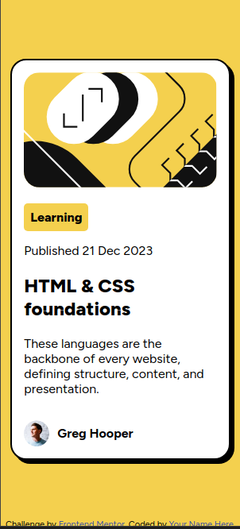

# Frontend Mentor - Blog preview card solution

This is a solution to the [Blog preview card challenge on Frontend Mentor](https://www.frontendmentor.io/challenges/blog-preview-card-ckPaj01IcS). Frontend Mentor challenges help you improve your coding skills by building realistic projects. 

## Table of contents

- [Overview](#overview)
  - [The challenge](#the-challenge)
  - [Screenshot](#screenshot)
  - [Links](#links)
- [My process](#my-process)
  - [Built with](#built-with)

## Overview
Easy Challenge to make a front end website real quick !

### The challenge

Users should be able to:

- See hover and focus states for all interactive elements on the page

### Screenshot

### Links

- Solution URL: [github_link](https://github.com/vb8146649/FrontEnd_Challenges/blog-preview-card-main/)
- Live Site URL: [live_site](https://vb8146649.github.io/FrontEnd_Challenges/blog-preview-card-main/)

## My process
Try & Build Approach

### Built with

- Semantic HTML5 markup
- CSS custom properties
- Flexbox
- CSS Grid
- Mobile-first workflow
