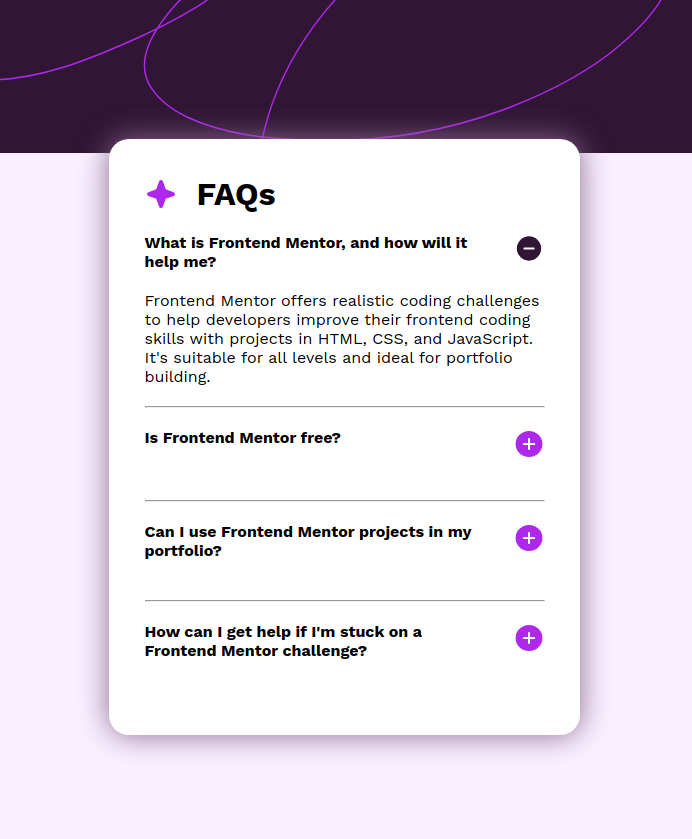

# Frontend Mentor - FAQ accordion solution

This is a solution to the [FAQ accordion challenge on Frontend Mentor](https://www.frontendmentor.io/challenges/faq-accordion-wyfFdeBwBz). Frontend Mentor challenges help you improve your coding skills by building realistic projects. 

## Table of contents

- [Overview](#overview)
  - [The challenge](#the-challenge)
  - [Screenshot](#screenshot)
  - [Links](#links)
- [My process](#my-process)
  - [Built with](#built-with)
  - [What I learned](#what-i-learned)
  - [Continued development](#continued-development)
  - [Useful resources](#useful-resources)
- [Author](#author)
- [Acknowledgments](#acknowledgments)

**Note: Delete this note and update the table of contents based on what sections you keep.**

## Overview
Build using only CSS and HTML

### The challenge

Users should be able to:

- Hide/Show the answer to a question when the question is clicked
- Navigate the questions and hide/show answers using keyboard navigation alone
- View the optimal layout for the interface depending on their device's screen size
- See hover and focus states for all interactive elements on the page

### Screenshot




### Links

- Solution URL: [github_link](https://github.com/vb8146649/faq-accordion-main)
- Live Site URL: [live_site](https://vb8146649.github.io/faq-accordion-main/)

## My process
Have Built using only css and html cause of detail tag in html which behave the same way .
Through try and Errors i was able to build this site .

### Built with

- Semantic HTML5 markup
- CSS custom properties
- Flexbox
- CSS Grid
- Mobile-first workflow

### What I learned

I have learnt how we can customize a background in css 

```css
.proud-of-this-css {
  background : url("something") no-repeat center center ,color no-repeat;
  background-size: size_for_url , size_for_color;
}
```
