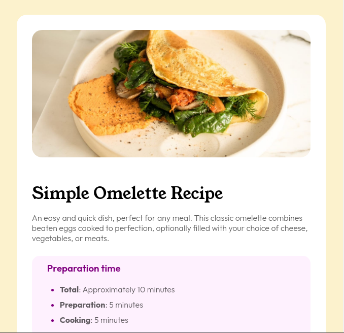

# Frontend Mentor - Recipe page solution

This is a solution to the [Recipe page challenge on Frontend Mentor](https://www.frontendmentor.io/challenges/recipe-page-KiTsR8QQKm). Frontend Mentor challenges help you improve your coding skills by building realistic projects. 

## Table of contents

- [Overview](#overview)
  - [The challenge](#the-challenge)
  - [Screenshot](#screenshot)
  - [Links](#links)
- [My process](#my-process)
  - [Built with](#built-with)
  - [What I learned](#what-i-learned)

## Overview
This is a simple static website , that is build purely from html and css .

### Screenshot

### Links

- Solution URL: [github_link](https://github.com/vb8146649/FrontEnd_Challenges/recipe-page-main)
- Live Site URL: [recipe_page](https://vb8146649.github.io/FrontEnd_Challenges/recipe-page-main/)

## My process
just compaired what matched with the preview of the given website still , I completed it .
More of a try and build method used here.

### Built with

- Semantic HTML5 markup
- CSS custom properties
- Flexbox
- CSS Grid
- Mobile-first workflow

### What I learned

I learned that my methods are too slow , I could have done it without problem if I were to use a more sequential procedure .
