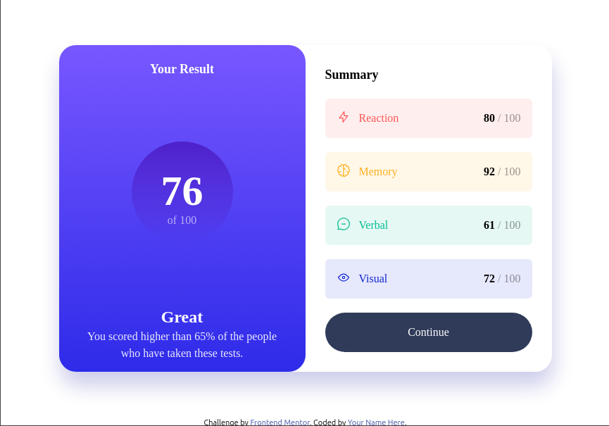

# Frontend Mentor - Results summary component solution

This is a solution to the [Results summary component challenge on Frontend Mentor](https://www.frontendmentor.io/challenges/results-summary-component-CE_K6s0maV). Frontend Mentor challenges help you improve your coding skills by building realistic projects. 

## Table of contents

- [Overview](#overview)
  - [The challenge](#the-challenge)
  - [Screenshot](#screenshot)
  - [Links](#links)
- [My process](#my-process)
  - [Built with](#built-with)
  - [What I learned](#what-i-learned)
  - [Continued development](#continued-development)
  - [Useful resources](#useful-resources)
- [Author](#author)

**Note: Delete this note and update the table of contents based on what sections you keep.**

## Overview

### The challenge

Users should be able to:

- View the optimal layout for the interface depending on their device's screen size
- See hover and focus states for all interactive elements on the page
- **Bonus**: Use the local JSON data to dynamically populate the content

### Screenshot



### Links

- Solution URL: [github_link](https://github.com/vb8146649/FrontEnd_Challenges/results-summary-component-main)
- Live Site URL: [live_site](https://vb8146649.github.io/FrontEnd_Challenges/results-summary-component-main/)

## My process

### Built with

- Semantic HTML5 markup
- CSS custom properties
- Flexbox
- CSS Grid
- Mobile-first workflow
- [Tailwind](https://tailwindcss.com/docs/) - For styles

**Note: These are just examples. Delete this note and replace the list above with your own choices**

### What I learned

I learned of various classes in tailwind . Learned to use inbuilt as well as custom classes . Learnt to use inline css inside tailwind css

```html
<h1>Some HTML code I'm proud of</h1>
```
```css
[using css line in the quare brackets in the tailwind css]
```
```js
colors:{
  'green-teel':'rgb_value',
}
```
this makes the custom class in tailwind to use 

### Continued development

I would try to use as much Tailwind CSS as I can to learn it as quickly as possible.

### Useful resources

- [TailWind CSS](https://tailwindcss.com/docs/) - This is an amazing article which helped me finally understand tailwind. I'd recommend it to anyone still learning this concept.

## Author

- Website - [Vishal](https://www.your-site.com)

